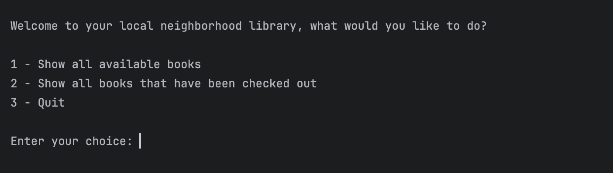
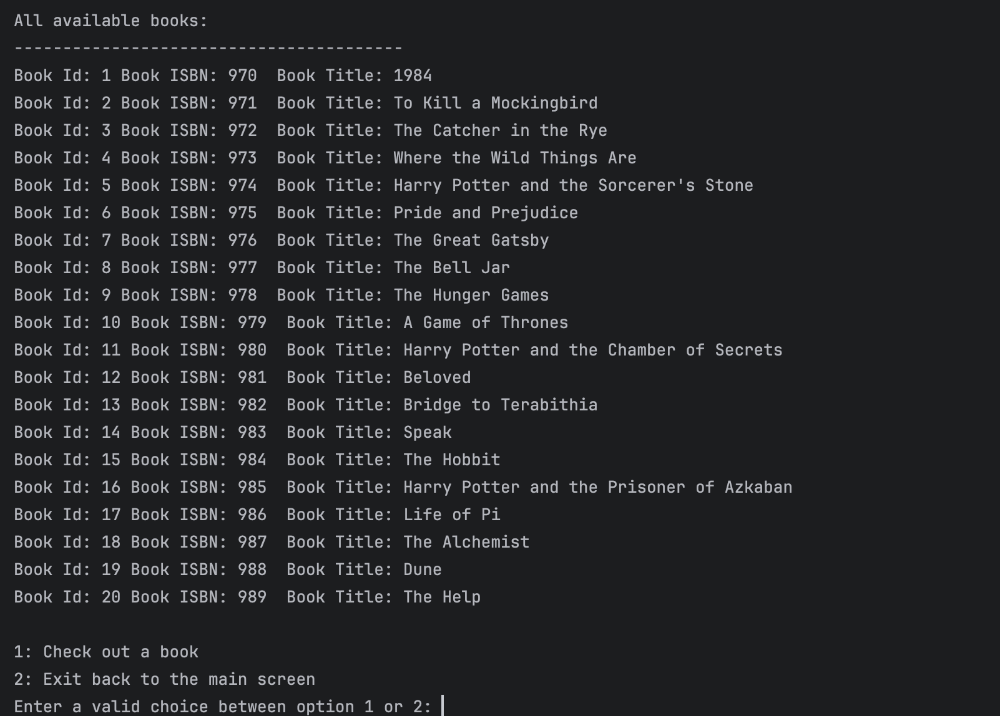
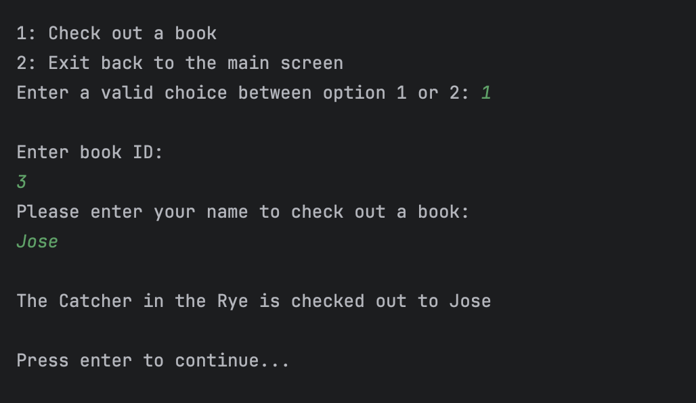
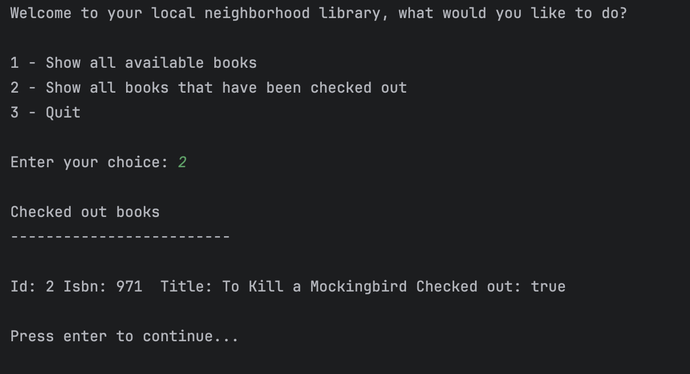
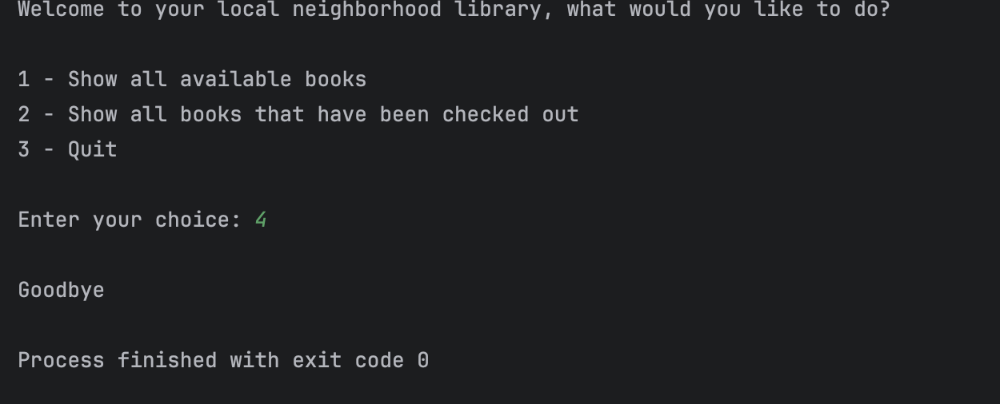

# neighborhood-library

# My Project overview

============================

For this project we were given the task to to create a library where residents from the community can check out a book based on the honor system. Anybody can check out a book by inputing their name and the application is able to track who checked out that specific book.

This takes the user to the home page giving them the option to check what available books the library has or to see what books been checked out. The last option is to quit the home page.

Once the user inputs the option to check what books are available, the book list gives the choices for available books.

The application asks the user for an option to check out a book and to provide the id of the book they would like. Once they input book id the application asks the user for their name and checks out the book in their name. The second option is to take the user back to the home page

Checking that the book we checked out is in the system and pulls the information for the book such as book id, isbn, title, and if it is checked out or not.

Once the user is done checking out a book, it allows the user to exit out of the application.
